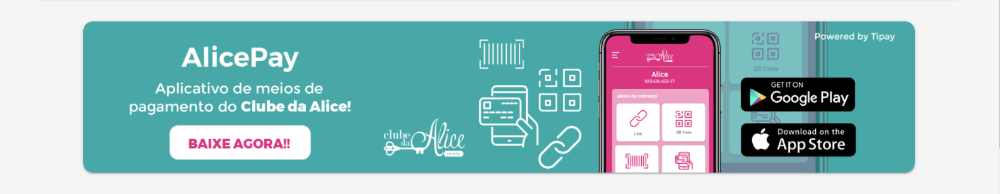

# Quasar App (clubalice)





A Quasar Framework app

## Install the dependencies

```bash
npm install
```

### Start the app in development mode (hot-code reloading, error reporting, etc.)

```bash
quasar dev
```

### Lint the files

```bash
npm run lint
```

### Build the app for production

```bash
quasar build
```
